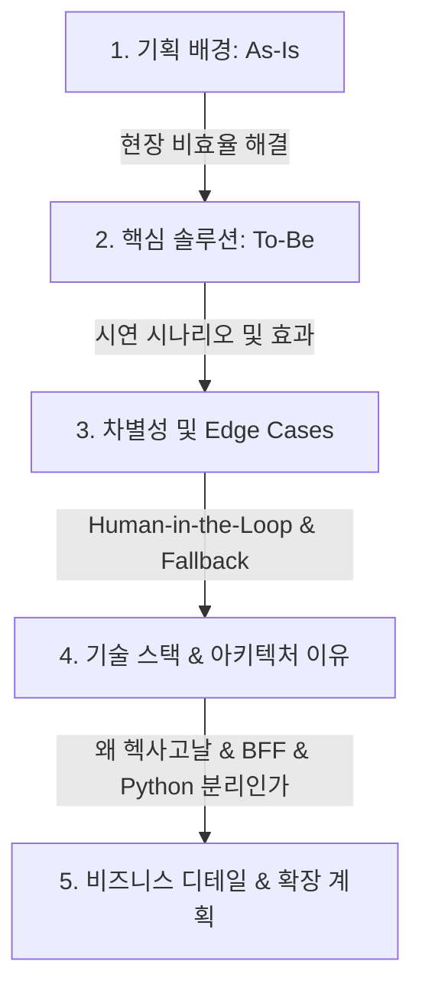

# 🏨 스마트 호텔 컨시어지 & 워크플로우 플랫폼 [아눅 : Anook]
> **2차 프로젝트 발표 자료 1차 초안 (기술 스펙 고도화 버전)**

---

## 📌 발표 흐름 개요 (15~20분 분량)



---

## 1️⃣ 기획 배경 (Why Anook?)
### 🔴 [As-Is] 현장 운영 비효율과 보이지 않는 커뮤니케이션 비용

*   **실제 호텔 현장의 목소리 (인터뷰 기반)**
    *   현재 많은 호텔들이 시스템 부재로 인해 **카카오톡 단체방이나 무전기**를 사용해 고객 요청을 수동 전파하고 있음.
    *   **프런트 데스크의 과부하**: 밀려드는 전화 문의, 대면 고객 응대, 타 부서 업무 전달을 동시에 처리하면서 **업무 누락**과 **지연**이 수시로 발생.
    *   특히 외국인 고객 응대 시 번역 및 소통 비용이 가중되어 업무 효율이 저하됨.
    *   교대 근무가 필수적인 호텔 특성상, 인수인계 과정에서 이전 근무자가 처리하던 업무 히스토리가 단절되는 현상 발생.
*   **숫자로 보는 낭비 지표 (시장 조사)**
    *   프런트 데스크 단순 반복 업무 비율: 전체 업무의 **약 60% 이상** 차지 (객실 물품 추가 요청, 정보 문의 등).
    *   수동 업무 전파 및 누락으로 인한 재처리 시간 낭비, 이로 인해 낭비되는 인건비와 고객 만족도(VOC) 하락 비용 제시.

---

## 2️⃣ 솔루션 및 기능 소개 (To-Be Workflow)
### 🟢 [To-Be] AI 기반 분석 및 구조화된 자동화 워크플로우

> **"아눅(Anook)은 고객의 비정형 자연어 요청을 AI가 분석해 적절한 부서로 자동 라우팅하고, 현장 직원이 처리 가능한 구조화된 업무(Task)로 변환해 주는 똑똑한 비서입니다."**

### 🎬 핵심 시연 시나리오 (하나의 스토리라인)
발표 시 라이브 데모보다는 녹화 영상을 활용하여 매끄러운 1개 업무의 흐름(End-to-End)을 시연합니다.

```
[고객] "수건 2개 더 주세요" (비정형 자연어/다국어)
   ↓ (AI 체감 대기시간 극복: Skeleton UI & "확인중" 즉시 응답 제공)
[AI 분석] intent: HOUSEKEEPING, item: TOWEL, count: 2 파싱 및 라우팅
   ↓
[업무 생성] 하우스키핑 대시보드에 실시간 업무(Task) 자동 등록 및 알림 발송
   ↓
[직원 처리] 담당 부서 직원이 실시간 알림 확인 후 객실에 수건 배달 및 완료 처리
   ↓
[완료 반영] 시스템 상태가 '완료'로 변경되며 고객 채팅창에 자동 완료 알림 및 VOC 만족도 유도
```

*   **도입 기대 효과 (정량적 수치)**
    *   프런트 데스크 전화 응대 및 메신저 전파 시간 **평균 80% 단축**.
    *   수동 전달 과정에서의 누락률 **0% 달성**.
    *   다국어(영어, 일어, 중국어 등) 즉시 번역 지원으로 외국인 소통 비용 제로화.

---

## 3️⃣ 차별성과 시장성 (Edge Cases & Trust)
### 🛡️ AI의 한계를 기술로 보완한 현실적 설계

우리가 가장 고민하고 많은 시간을 투자한 부분은 **"100% 완벽할 수 없는 AI의 한계를 어떻게 실제 비즈니스 관점에서 보완했는가"**입니다. 심사위원(기업)이 신뢰할 수 있는 강점을 어필합니다.

#### 1. 에러 및 AI 한계 극복 (Fallback & Escalation)
*   AI의 판단 확신도(Confidence Score)가 낮거나 모호한 비정형 질문일 경우, 억지로 답변하지 않고 즉시 **프런트 데스크 직원(Human)에게 실시간 이관**하여 1:1 채팅 데스크로 전환시킵니다.
*   연속적인 무한 되묻기 방어 로직을 적용하여 3회 이상 되묻기가 발생할 경우 시스템이 강제로 FRONT로 이관하여 고객 피로도를 최소화합니다.

#### 2. AI Reasoning (인공지능의 투명성)
*   실무자는 AI의 결정에 불안감을 가집니다. 
*   "왜 AI가 이 부서로 업무를 배분했는지", "왜 이런 답변을 도출했는지"에 대한 **추론 근거(Reasoning)**를 대시보드 로그에 시각화하여 제공함으로써, 직원이 AI의 상태를 상시 모니터링하고 신뢰할 수 있는 환경을 구축했습니다.

#### 3. 다중 접속 경합 방지 (Concurrency Lock)
*   여러 명의 직원이 대시보드에서 하나의 요청을 동시에 수락(Accept)하려고 할 때 발생하는 경합 문제.
*   데이터베이스에 **낙관적 락(Optimistic Locking, `@Version`)**을 적용하여 중복 배정을 기술적으로 완벽히 차단하고, 늦게 누른 직원에게는 즉각 최신화된 정보와 양보 메시지를 제공합니다.

#### 4. 오프라인 퍼스트 (Offline-First UX)
*   호텔 엘리베이터나 데드존(Wi-Fi 음영지대) 등 네트워크 음영 구역에서 직원의 앱 조작이 프리징되는 것을 방지합니다.
*   **액션 이원화 전략**:
    *   *독점 액션(내 업무 완료)*: 네트워크 단절 시에도 **IndexedDB**에 액션을 기록하고 UI에 선반영(Optimistic UI)한 후 온라인 복귀 시 백그라운드 동기화(Background Sync).
    *   *경쟁 액션(미배정 수락)*: 헛걸음을 방지하기 위해 오프라인 상태 시 즉시 조작을 비활성화하고 안내 팝업을 노출.

---

## 4️⃣ 기술 스택 및 아키텍처 선정 사유 (Why these tech?)
단순한 기술 나열을 탈피하여, **"비즈니스 요구사항 해결을 위해 왜 이 구조여야만 했는지"** 당위성을 기술합니다.

### 1. Spring Boot: 헥사고날 아키텍처 (Hexagonal Architecture)
*   **이유**: 호텔 운영 시스템은 부서(하우스키핑, F&B, 프런트 등)별 업무 흐름이 다르고 요구사항 변화가 잦습니다. 
*   핵심 도메인 로직을 외부 기술(JPA, Spring Security, DB 등)과 완전히 분리하는 **Ports & Adapters 패턴**을 도입함으로써, 타 모듈의 코드 영향 없이 특정 부서 로직만 쉽고 안전하게 확장 및 유지보수 할 수 있도록 설계했습니다.

### 2. Next.js: BFF (Backend-for-Frontend) 패턴
*   **이유**: 브라우저 클라이언트가 백엔드 API와 직접 통신할 때 발생할 수 있는 보안 위협(JWT 토큰 탈취, CORS 이슈)을 완전히 방지하고자 했습니다.
*   Next.js 서버가 중계자(Proxy) 역할을 수행하는 BFF 레이어를 구현하였고, 암호화 쿠키 세션(`iron-session`)을 도입하여 클라이언트 환경에는 민감 정보를 절대 노출하지 않는 견고한 보안 프레임워크를 적용했습니다.

### 3. Python FastAPI + pgvector
*   **이유**: 대규모 트래픽 분산과 가벼운 AI 추론을 위해 Spring Boot와 AI 추론 서버를 분리했습니다.
*   PostgreSQL의 **`pgvector`** 모듈을 사용하여 실시간 임베딩 벡터 코사인 유사도 검색을 구현했습니다. 이를 통해 수만 개의 매뉴얼 속에서도 고객 질문에 가장 알맞은 답변을 밀리초(ms) 단위로 정확히 끄집어내는 초고속 RAG 인프라를 완성했습니다.

---

## 5️⃣ 기업이 좋아하는 디테일 & 확장 계획 (Next Steps)
### 💼 실무 친화적 운영 안전장치

1.  **긴급 상황(Emergency Mode) 자동 필터링**: 화재, 응급 환자, 누수 등 핵심 위급 키워드 감지 시, 모든 AI 라우터를 우회하여 최상위 우선순위(URGENT)로 실시간 푸시 알림과 즉각적인 인간 개입을 유도합니다.
2.  **출력 토큰 초경량화 및 태스크 코드화(Pipeline Separator)**:
    *   AI가 구구절절 말하거나 무거운 JSON 포맷을 쓰지 않고, 파이프 라인 구분자를 사용한 태스크 코드(`HK|NORM|REQ_ITEM|TOWEL|2`)로만 즉각 응답하도록 유도하여 **출력 토큰 비용을 80~90% 절감**하고 파싱 에러를 0%로 만들었습니다.
3.  **지연시간 Zero의 PII 개인정보 보호**:
    *   개인정보(전화번호, 계좌 등) 유출을 방지하기 위해 AI로 텍스트를 보내기 전 1ms 안에 작동하는 **초경량 정규표현식(Regex) 마스킹 필터**를 통해 보안성과 처리 속도를 모두 잡았습니다.
4.  **AI 기반 자동 교대 인수인계 브리핑 (Shift Handover)**:
    *   근무 교대 시, 백엔드에서 해당 시간대의 [미처리 업무, 에스컬레이션 로그, 긴급 요청] 데이터셋을 취합해 Gemini에 1번의 쿼리로 주입하여 **3~5줄의 자연어 인수인계 브리핑 초안을 자동 생성**합니다.

---

### 🚀 향후 확장 계획

#### 🎨 [UI/UX] 화이트라벨링 테마 제공 (White-labeling Design)
*   플랫폼을 사용하는 호텔마다 자신들의 고유한 브랜드 가이드(로고, 색상, 폰트 등)가 있습니다.
*   Anook의 디자인 정체성을 강제하지 않고, 각 호텔 관리자가 대시보드 내에서 테마 메인 컬러, 폰트, 로고 및 컴포넌트 커스텀을 직접 세팅하여 각자의 호텔 전용 앱처럼 사용할 수 있는 화이트라벨 옵션 확장을 계획하고 있습니다.

#### 🔄 [AI/RAG] 데이터 플라이휠(Data Flywheel)을 통한 RAG 자동 고도화
*   초기 오픈 시 최소한의 FAQ로 시작한 뒤, RAG 검색이 안 되어 에스컬레이션된 미답변 질문들을 주기적으로 AI가 자동 군집화(Clustering)하고 추천 답변을 생성합니다.
*   관리자는 대시보드에서 **원클릭 승인**만 하면 pgvector DB에 즉시 임베딩 저장되어, 호텔을 운영할수록 지식창고가 스스로 성장(Evolution)하게 됩니다.
